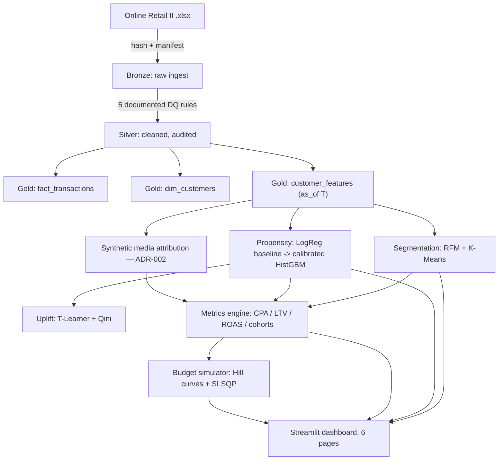

<p align="center">
  
</p>

<h1 align="center">AdEngine</h1>
<p align="center"><b>Marketing analytics: propensity, RFM segmentation, media metrics, and budget optimization</b></p>
<p align="center">A production-shaped data product built on the Online Retail II (UCI) dataset — not a notebook.</p>

---

## The problem, in three sentences

A retailer needs to know which customers will buy again, which behavioral segments its base actually contains, and how to
split a fixed media budget across channels under diminishing returns. Answering all three honestly requires a real medallion
pipeline with an anti-leakage guarantee, a calibrated (not just accurate) model, and a metrics engine built from pure,
testable functions — not three disconnected notebooks that happen to load the same CSV.

AdEngine is that pipeline, plus a six-page dashboard that consumes only its output artifacts.

## Architecture



**Non-negotiable principles:** zero-cost stack (pandas, scikit-learn, Plotly, Streamlit, `lifetimes`); full reproducibility
from a clean checkout; strict separation between exploration and production code; no temporal leakage, ever; the synthetic
media-attribution layer is labeled everywhere it appears.

## Run it

The gold-layer artifacts (`data/marts/`) and trained models (`models/`) are committed to this repository, so the
dashboard works immediately without running the pipeline first:

```bash
pip install -e ".[dev]"
streamlit run app/Home.py
```

To reproduce those artifacts from scratch instead (e.g. after changing a config or to verify the pipeline yourself):

```bash
pip install -e ".[dev]"
python -m adengine.cleaning --config configs/pipeline.yaml && \
  python -m adengine.features --config configs/pipeline.yaml && \
  python -m adengine.attribution --config configs/attribution.yaml --pipeline-config configs/pipeline.yaml
python -m adengine.segmentation --config configs/model.yaml --pipeline-config configs/pipeline.yaml && \
  python -m adengine.propensity --config configs/model.yaml --pipeline-config configs/pipeline.yaml && \
  python -m adengine.metrics --config configs/model.yaml --pipeline-config configs/pipeline.yaml && \
  python -m adengine.simulator --config configs/model.yaml --pipeline-config configs/pipeline.yaml
streamlit run app/Home.py
```

(Equivalently: `make download && make pipeline && make train && make app` on a system with `make`.) The raw `.xlsx` is
downloaded once, hashed, and cached; every subsequent run reads the cached Parquet bronze layer. Only the raw source file
and the silver intermediate are gitignored (large and fully regenerable) — everything the dashboard actually reads is
versioned.

## Results

**Pipeline (Bronze → Silver):** 1,067,371 raw rows → 776,828 silver rows (**72.8% retention**), across 5 documented,
row-impact-logged rules — the largest single cut is `missing_customer_id` (22.6%, unavoidable: no key, no customer to score).

**Segmentation:** K=5 chosen over the silhouette-maximizing K=2 for business interpretability (see
[ADR-006](docs/adr/006-segmentation-k-selection.md)) — bootstrap-resampled **ARI = 0.95** (≥ 0.85 acceptance bar). The five
segments' realized 90-day conversion rates fall out monotonically from the RFM structure itself, which is the real
validation that the clusters mean something:

| Segment | Size | % of base | 90d conversion |
|---|---:|---:|---:|
| Champions | 635 | 12.7% | 80.5% |
| Loyal Customers | 1,311 | 26.1% | 51.6% |
| Potential Loyalists | 1,297 | 25.9% | 21.0% |
| At Risk | 1,008 | 20.1% | 19.4% |
| Hibernating | 763 | 15.2% | 5.8% |

**Propensity model:** calibrated HistGradientBoosting vs. logistic-regression baseline, temporal validation
(T_train=2011-03-31 → T_test=2011-06-30, never random k-fold):

| | ROC-AUC | PR-AUC | Brier |
|---|---:|---:|---:|
| Logistic baseline | 0.812 | 0.718 | 0.174 |
| HistGBM (raw) | 0.811 | 0.721 | 0.160 |
| HistGBM (isotonic-calibrated) | **0.815** | **0.724** | **0.159** |

Honest read: the GBM's edge over the linear baseline is real but modest — RFM-style behavioral features are largely
monotonic, so a logistic model captures most of the signal. The GBM earns its place through calibration quality (Brier drops
after calibration), which is what the budget simulator actually depends on, not through a dramatic AUC gap. Recency
dominates permutation importance, consistent with RFM theory.

**Uplift (T-Learner + Qini):** the campaign-exposure flag is assigned uniformly at random by the synthetic layer
([ADR-002](docs/adr/002-synthetic-attribution.md)), so the true treatment effect is zero for every customer by
construction. The resulting Qini coefficient (−0.83, population-normalized, sampling noise in either direction) is the
*correct* result — it demonstrates the T-Learner + Qini machinery end-to-end, not a real causal claim.

**Media metrics (synthetic layer):** ROAS uses revenue realized in the same 90-day window as conversions; LTV:CAC compares
a 12-month BG/NBD-projected value against a one-time acquisition cost, so it runs structurally larger than ROAS:

| Channel | CPA | ROAS (90d) | LTV:CAC |
|---|---:|---:|---:|
| Email | £95.23 | 11.1× | 71.4× |
| Paid Social | £267.53 | 5.1× | 18.1× |
| Paid Search | £331.61 | 3.2× | 15.6× |
| Display | £507.07 | 1.7× | 8.4× |

**Budget simulator:** SLSQP-optimized allocation of a £50,000 monthly budget projects **1,629 conversions**
(bootstrap 10–90% range: 1,604–1,653, 200 resamples) — cheap, low-ceiling channels (Email) get saturated quickly; the
majority of incremental budget flows to the channel with the largest addressable ceiling (Paid Search).

## Decisions and trade-offs

Every non-obvious call is recorded as an ADR, not buried in a commit message:

- [ADR-001 — Temporal anti-leakage design](docs/adr/001-temporal-cutoff.md)
- [ADR-002 — Synthetic media attribution](docs/adr/002-synthetic-attribution.md)
- [ADR-003 — Cancellation/returns treatment](docs/adr/003-cancellation-treatment.md)
- [ADR-004 — Propensity model temporal validation design](docs/adr/004-temporal-validation-design.md)
- [ADR-005 — Hill function for budget response curves](docs/adr/005-hill-response-curves.md)
- [ADR-006 — Segmentation K selection](docs/adr/006-segmentation-k-selection.md)

## Known limitations

- **The media-attribution layer is entirely synthetic** (channel, cost, campaign exposure) — Online Retail II has no such
  data. It is parameterized in `configs/attribution.yaml`, conditioned on real historical customer value, and labeled
  "Synthetic" everywhere it surfaces. Swapping in a real ad-platform export requires new config, not new code.
- **Returns are removed, not netted**, against the original sale — there is no reliable join key in the source data to net
  them correctly (ADR-003).
- **The uplift/Qini analysis is a methodology demonstration**, not a causal finding — the treatment flag carries no real
  signal by construction.
- **`lifetimes` (BG/NBD + Gamma-Gamma) is not under active maintenance.** `metrics.fit_bgnbd_gamma_gamma` has an automatic,
  tested fallback to a heuristic LTV (`AOV × annual frequency × margin × horizon`) if the fit fails.

## Project layout

```
src/adengine/     ingestion, cleaning, contracts, features, attribution,
                  segmentation, propensity, metrics, simulator — one module
                  per pipeline stage, each independently testable
app/              Streamlit dashboard (Home + 5 pages); reads only from
                  data/marts/ and models/, never trains or re-runs the pipeline
configs/          pipeline.yaml, attribution.yaml, model.yaml — every cutoff,
                  hyperparameter, and seed lives here, not in code
tests/            pytest suite: DQ rules, anti-leakage, pure metric functions
                  + edge cases, simulator properties, an end-to-end smoke test
docs/adr/         architecture decision records
```

## Development

```bash
make test    # pytest -v --cov=src/adengine
make lint    # ruff check src/ tests/ app/
```

CI (`.github/workflows/ci.yml`) runs lint and the full test suite against the versioned fixture in `tests/fixtures/` — it
never downloads the real dataset, so it stays fast (< 2 minutes) and deterministic.
