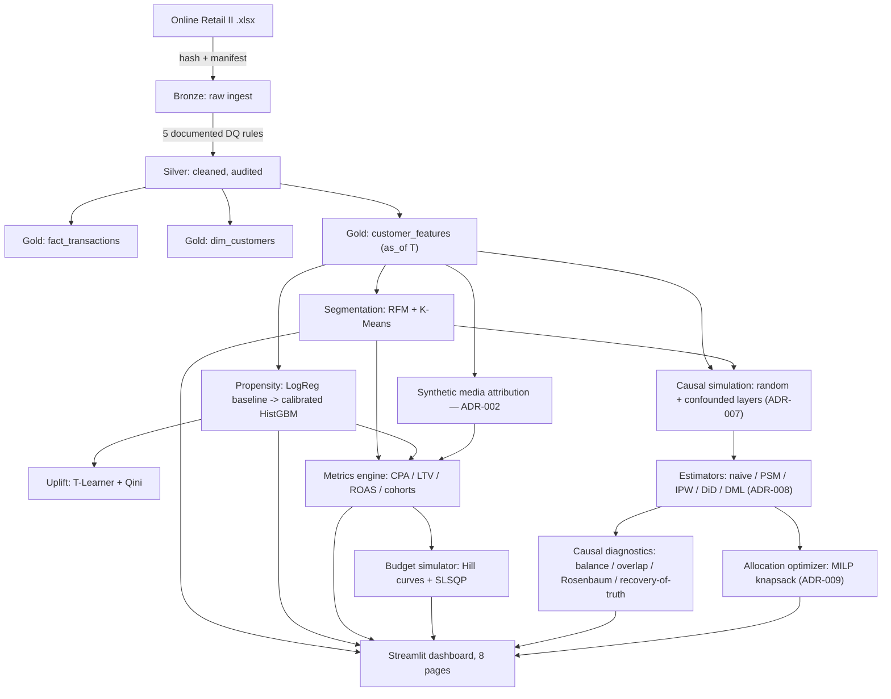

<p align="center">
  
</p>

<h1 align="center">AdEngine</h1>
<p align="center"><b>Marketing analytics: propensity, RFM segmentation, causal inference, media metrics, and budget optimization</b></p>
<p align="center">A production-shaped data product built on the Online Retail II (UCI) dataset — not a notebook.</p>

---

## The problem, in three sentences

A retailer needs to know which customers will buy again, which behavioral segments its base actually contains, and how to
split a fixed media budget across channels under diminishing returns. Answering all three honestly requires a real medallion
pipeline with an anti-leakage guarantee, a calibrated (not just accurate) model, and a metrics engine built from pure,
testable functions — not three disconnected notebooks that happen to load the same CSV.

A fourth question sits on top of the first three: once you know *who* is likely to respond, how do you tell a genuine
causal effect apart from a confounded correlation, and which customers should actually receive a constrained budget's
worth of treatment? Online Retail II has no real experiment to answer that with, so AdEngine builds a second synthetic
layer with a *known* causal effect (ADR-007) purely to validate five estimators — naive, PSM, IPW, DiD, and Double ML —
against ground truth, then feeds the result into a budget-constrained MILP targeting optimizer.

AdEngine is that pipeline, plus an eight-page dashboard that consumes only its output artifacts.

## Architecture


```mermaid
flowchart TD
    A[Online Retail II .xlsx] -->|hash + manifest| B[Bronze: raw ingest]
    B -->|5 documented DQ rules| C[Silver: cleaned, audited]
    C --> D1[Gold: fact_transactions]
    C --> D2[Gold: dim_customers]
    C --> D3["Gold: customer_features (as_of T)"]
    D3 --> E1[Segmentation: RFM + K-Means]
    D3 --> E2["Propensity: LogReg baseline -> calibrated HistGBM"]
    E2 --> E3[Uplift: T-Learner + Qini]
    D3 --> F[Synthetic media attribution — ADR-002]
    E1 --> G[Metrics engine: CPA / LTV / ROAS / cohorts]
    E2 --> G
    F --> G
    G --> H[Budget simulator: Hill curves + SLSQP]
    D3 --> J["Causal simulation: random + confounded layers (ADR-007)"]
    E1 --> J
    J --> K["Estimators: naive / PSM / IPW / DiD / DML (ADR-008)"]
    K --> L[Causal diagnostics: balance / overlap / Rosenbaum / recovery-of-truth]
    K --> M["Allocation optimizer: MILP knapsack (ADR-009)"]
    E1 --> I[Streamlit dashboard, 8 pages]
    E2 --> I
    G --> I
    H --> I
    L --> I
    M --> I
```

**Non-negotiable principles:** zero-cost stack (pandas, scikit-learn, scipy, Plotly, Streamlit, `lifetimes`) — the entire
causal-inference and MILP-allocation extension adds **zero new dependencies** to this list; full reproducibility from a
clean checkout; strict separation between exploration and production code; no temporal leakage, ever; every synthetic
layer (media attribution, causal ground truth) is labeled everywhere it appears.

## Run it

The gold-layer artifacts (`data/marts/`) and trained models (`models/`) are committed to this repository, so the
dashboard works immediately without running the pipeline first:

```bash
pip install -e ".[dev]"
streamlit run app/Home.py
```

To reproduce those artifacts from scratch instead (e.g. after changing a config or to verify the pipeline yourself):

```bash
pip install -e ".[dev]"
python -m adengine.cleaning --config configs/pipeline.yaml && \
  python -m adengine.features --config configs/pipeline.yaml && \
  python -m adengine.attribution --config configs/attribution.yaml --pipeline-config configs/pipeline.yaml
python -m adengine.segmentation --config configs/model.yaml --pipeline-config configs/pipeline.yaml && \
  python -m adengine.propensity --config configs/model.yaml --pipeline-config configs/pipeline.yaml && \
  python -m adengine.metrics --config configs/model.yaml --pipeline-config configs/pipeline.yaml && \
  python -m adengine.simulator --config configs/model.yaml --pipeline-config configs/pipeline.yaml
python -m adengine.causal_simulation --config configs/causal.yaml --pipeline-config configs/pipeline.yaml && \
  python -m adengine.causal_diagnostics --config configs/causal.yaml --pipeline-config configs/pipeline.yaml && \
  python -m adengine.allocation_optimizer --config configs/allocation.yaml --causal-config configs/causal.yaml --pipeline-config configs/pipeline.yaml
streamlit run app/Home.py
```

(Equivalently: `make download && make pipeline && make train && make causal && make app` on a system with `make`.) The
raw `.xlsx` is downloaded once, hashed, and cached; every subsequent run reads the cached Parquet bronze layer. Only the
raw source file and the silver intermediate are gitignored (large and fully regenerable) — everything the dashboard
actually reads is versioned, including every causal-inference and allocation artifact.

## Results

**Pipeline (Bronze → Silver):** 1,067,371 raw rows → 776,828 silver rows (**72.8% retention**), across 5 documented,
row-impact-logged rules — the largest single cut is `missing_customer_id` (22.6%, unavoidable: no key, no customer to score).

**Segmentation:** K=5 chosen over the silhouette-maximizing K=2 for business interpretability (see
[ADR-006](docs/adr/006-segmentation-k-selection.md)) — bootstrap-resampled **ARI = 0.95** (≥ 0.85 acceptance bar). The five
segments' realized 90-day conversion rates fall out monotonically from the RFM structure itself, which is the real
validation that the clusters mean something:

| Segment | Size | % of base | 90d conversion |
|---|---:|---:|---:|
| Champions | 635 | 12.7% | 80.5% |
| Loyal Customers | 1,311 | 26.1% | 51.6% |
| Potential Loyalists | 1,297 | 25.9% | 21.0% |
| At Risk | 1,008 | 20.1% | 19.4% |
| Hibernating | 763 | 15.2% | 5.8% |

**Propensity model:** calibrated HistGradientBoosting vs. logistic-regression baseline, temporal validation
(T_train=2011-03-31 → T_test=2011-06-30, never random k-fold):

| | ROC-AUC | PR-AUC | Brier |
|---|---:|---:|---:|
| Logistic baseline | 0.812 | 0.718 | 0.174 |
| HistGBM (raw) | 0.811 | 0.721 | 0.160 |
| HistGBM (isotonic-calibrated) | **0.815** | **0.724** | **0.159** |

Honest read: the GBM's edge over the linear baseline is real but modest — RFM-style behavioral features are largely
monotonic, so a logistic model captures most of the signal. The GBM earns its place through calibration quality (Brier drops
after calibration), which is what the budget simulator actually depends on, not through a dramatic AUC gap. Recency
dominates permutation importance, consistent with RFM theory.

**Uplift (T-Learner + Qini):** the campaign-exposure flag is assigned uniformly at random by the synthetic layer
([ADR-002](docs/adr/002-synthetic-attribution.md)), so the true treatment effect is zero for every customer by
construction. The resulting Qini coefficient (−0.83, population-normalized, sampling noise in either direction) is the
*correct* result — it demonstrates the T-Learner + Qini machinery end-to-end, not a real causal claim.

**Media metrics (synthetic layer):** ROAS uses revenue realized in the same 90-day window as conversions; LTV:CAC compares
a 12-month BG/NBD-projected value against a one-time acquisition cost, so it runs structurally larger than ROAS:

| Channel | CPA | ROAS (90d) | LTV:CAC |
|---|---:|---:|---:|
| Email | £95.23 | 11.1× | 71.4× |
| Paid Social | £267.53 | 5.1× | 18.1× |
| Paid Search | £331.61 | 3.2× | 15.6× |
| Display | £507.07 | 1.7× | 8.4× |

**Budget simulator:** SLSQP-optimized allocation of a £50,000 monthly budget projects **1,629 conversions**
(bootstrap 10–90% range: 1,604–1,653, 200 resamples) — cheap, low-ceiling channels (Email) get saturated quickly; the
majority of incremental budget flows to the channel with the largest addressable ceiling (Paid Search).

**Causal inference (recovery of truth):** a fully synthetic potential-outcomes model (ADR-007) with a known true ATE of
**0.108**, observed under both random and confounded assignment. Five estimators, ranked by absolute error against that
known truth:

| Method | Estimated ATE | Absolute error | 95% CI captures truth |
|---|---:|---:|:---:|
| Double ML | 0.120 | **0.013** | ✓ |
| Difference-in-Differences | 0.090 | 0.018 | ✓ |
| Inverse Propensity Weighting | 0.127 | 0.019 | ✓ |
| Propensity Score Matching | 0.083 | 0.025 | ✗ |
| Naive diff-in-means | 0.300 | 0.193 | ✗ |

The naive comparison overstates the true effect by ~3× under confounding — exactly the failure mode PSM/IPW/DiD/DML exist
to correct. PSM alone drops the confounding covariate's standardized mean difference from 1.04 to 0.01 (well under the
0.1 acceptance bar); Rosenbaum sensitivity analysis shows it would take a hidden confounder with an odds ratio of
roughly 1.4–1.5 to overturn that matched-pairs result. Every estimator here — hand-rolled Double ML included — runs on
`pandas`/`scikit-learn`/`scipy` only (see ADR-008 for why this isn't `econml`).

**Budget allocation (MILP):** given a £5,000 budget and a per-customer CATE estimate (T-Learner), the exact 0/1-knapsack
solution (`scipy.optimize.milp`, HiGHS) treats **848 of 5,014** customers for a total incremental value of **331.24**,
edging out a greedy cate/cost heuristic (**331.18**) — treating every customer with a positive predicted effect would
need £29,036, **5.8×** the actual budget, which is the real cost the budget constraint imposes. See ADR-009 for why this
is `scipy.optimize.milp` rather than OR-Tools.

## Decisions and trade-offs

Every non-obvious call is recorded as an ADR, not buried in a commit message:

- [ADR-001 — Temporal anti-leakage design](docs/adr/001-temporal-cutoff.md)
- [ADR-002 — Synthetic media attribution](docs/adr/002-synthetic-attribution.md)
- [ADR-003 — Cancellation/returns treatment](docs/adr/003-cancellation-treatment.md)
- [ADR-004 — Propensity model temporal validation design](docs/adr/004-temporal-validation-design.md)
- [ADR-005 — Hill function for budget response curves](docs/adr/005-hill-response-curves.md)
- [ADR-006 — Segmentation K selection](docs/adr/006-segmentation-k-selection.md)
- [ADR-007 — Confounded-assignment causal simulation design](docs/adr/007-confounded-assignment-causal-simulation.md)
- [ADR-008 — Estimator selection & validation criteria](docs/adr/008-estimator-selection-and-validation.md)
- [ADR-009 — MILP budget-constrained allocation formulation](docs/adr/009-milp-allocation-formulation.md)

## Known limitations

- **The media-attribution layer is entirely synthetic** (channel, cost, campaign exposure) — Online Retail II has no such
  data. It is parameterized in `configs/attribution.yaml`, conditioned on real historical customer value, and labeled
  "Synthetic" everywhere it surfaces. Swapping in a real ad-platform export requires new config, not new code.
- **Returns are removed, not netted**, against the original sale — there is no reliable join key in the source data to net
  them correctly (ADR-003).
- **The uplift/Qini analysis is a methodology demonstration**, not a causal finding — the treatment flag carries no real
  signal by construction.
- **`lifetimes` (BG/NBD + Gamma-Gamma) is not under active maintenance.** `metrics.fit_bgnbd_gamma_gamma` has an automatic,
  tested fallback to a heuristic LTV (`AOV × annual frequency × margin × horizon`) if the fit fails.
- **The causal-inference ground truth is entirely synthetic** (ADR-007) — Online Retail II has no real experiment to
  validate an estimator against. Every number on the Causal Identification page is a recovery-of-truth demonstration
  against a known effect, not a real causal claim about Online Retail II customers.
- **Individual-level CATE prediction is noisy.** `causal_estimators.t_learner_cate` (used for per-customer targeting in
  `allocation_optimizer.py`) tracks the true *segment-average* CATE well but any single customer's predicted score
  carries real estimation error — a single binary outcome per customer is mostly irreducible noise, not something more
  data alone fixes. The allocation optimizer is validated on aggregate outcomes, not on individual predictions.

## Project layout

```
src/adengine/     ingestion, cleaning, contracts, features, attribution,
                  segmentation, propensity, metrics, simulator — one module
                  per pipeline stage, each independently testable; plus
                  causal_simulation, causal_estimators, causal_diagnostics,
                  and allocation_optimizer for the causal-inference extension
app/              Streamlit dashboard (Home + 7 pages); reads only from
                  data/marts/ and models/, never trains or re-runs the pipeline
configs/          pipeline.yaml, attribution.yaml, model.yaml, causal.yaml,
                  allocation.yaml — every cutoff, hyperparameter, and seed
                  lives here, not in code
tests/            pytest suite: DQ rules, anti-leakage, pure metric functions
                  + edge cases, simulator properties, an end-to-end smoke test,
                  and the causal-inference / allocation estimator suite
docs/adr/         architecture decision records
```

## Development

```bash
make test    # pytest -v --cov=src/adengine
make lint    # ruff check src/ tests/ app/
```

CI (`.github/workflows/ci.yml`) runs lint and the full test suite against the versioned fixture in `tests/fixtures/` — it
never downloads the real dataset, so it stays fast (< 2 minutes) and deterministic.
